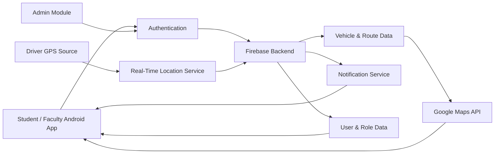
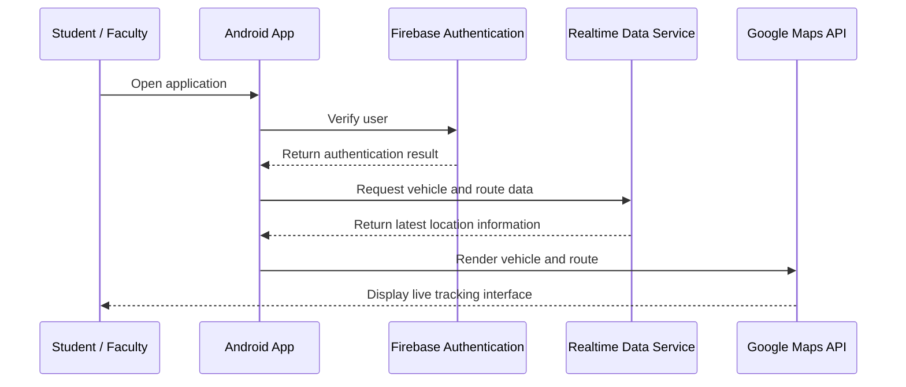

<div align="center">


<p>
<a href="https://github.com/akashcse02?tab=followers"></a>


</p>


</div>

<!-- ========================= IDENTITY ========================= -->

<div align="center">

</div>

<table>
<tr>
<td width="58%" valign="top">

name: Md Akash Islam<br>
role: Full-Stack Web Developer<br>
education: Final-Year CSE Student<br>
location: Bangladesh<br>
flagship_project: Pundra GeoTracker<br>
engineering_style: User-focused, practical, scalable<br>
mission: Build reliable systems that improve everyday life<br>

I am a final-year Computer Science and Engineering student building practical products across full-stack web development, Android applications, artificial intelligence and real-time GPS systems.

I enjoy transforming real-world problems into structured software by connecting intuitive interfaces, backend services, live data and dependable product workflows.

</td>
<td width="42%" align="center" valign="middle">


</td>
</tr>
</table>

<div align="center">


<br/><br/>


</div>

<!-- ========================= PROJECT ========================= -->

<div align="center">


<p>


</p>

<a href="https://github.com/akashcse02/PUB-Vehicle-Location-Detection">

</a>

</div>

<table>
<tr>
<td width="50%" valign="top">

<div align="center">

</div>

Students and faculty often have limited visibility into campus vehicle locations and arrival times. This creates unnecessary waiting, missed transportation and poor daily travel planning.

</td>
<td width="50%" valign="top">

<div align="center">

</div>

Pundra GeoTracker brings live vehicle location, routes, ETA and transportation alerts into one role-based Android platform powered by GPS, Firebase and Google Maps.

</td>
</tr>
</table>

<div align="center">


</div>

| System Module | Product Value |
|---|---|
| Live GPS Tracking | Displays the latest campus vehicle location on Google Maps |
| ETA Support | Helps users estimate when a vehicle may reach a stop |
| Route Monitoring | Visualizes assigned routes and transportation stops |
| Real-Time Alerts | Delivers relevant vehicle and route updates |
| Role-Based Access | Supports student, teacher, administrator and driver workflows |
| Operations Management | Manages vehicles, users, routes and tracking information |

<div align="center">


</div>

<details>
<summary><b>🧩 Open Animated System Architecture</b></summary>
<br/>

<div align="center">

</div>



</details>

<details>
<summary><b>🔄 Open Animated User Flow</b></summary>
<br/>

<div align="center">

</div>



</details>

<!-- ========================= TECH ========================= -->

<div align="center">


**FULL-STACK WEB**


**MOBILE · BACKEND · PROGRAMMING**


**ENGINEERING TOOLS**


<br/><br/>


</div>

<!-- ========================= PROFILE ========================= -->

<div align="center">


</div>

```js
const akash = {
  name: "MD Akash Islam",
  role: "Full-Stack Web Developer",
  education: "Final-Year CSE Student",
  building: "Pundra GeoTracker",

  domains: [
    "Full-Stack Web Development",
    "Android Development",
    "Artificial Intelligence",
    "Real-Time GPS Systems"
  ],

  engineeringValues: [
    "Problem Solving",
    "Clean Architecture",
    "User-Focused Development",
    "Continuous Learning",
    "Team Collaboration"
  ],

  nextMission: "Build production-ready software with measurable impact"
};
```

<div align="center">

</div>

<!-- ========================= ANALYTICS ========================= -->

<div align="center">


</div>

<!-- ========================= TROPHIES ========================= -->

<div align="center">


</div>

<!-- ========================= CONTRIBUTION ANIMATION (3D, replaces snake) ========================= -->

<div align="center">


<picture>
  <source media="(prefers-color-scheme: dark)" srcset="https://raw.githubusercontent.com/akashcse02/akashcse02/output/github-contribution-grid-3d-dark.svg"/>
  <source media="(prefers-color-scheme: light)" srcset="https://raw.githubusercontent.com/akashcse02/akashcse02/output/github-contribution-grid-3d.svg"/>
  
</picture>

<sub>⚠️ এই 3D grid দেখতে হলে আপনার repo-তে <a href="https://github.com/Platane/snk">Platane/snk</a> GitHub Action সেটআপ করে <code>output</code> branch generate করতে হবে — নাহলে image broken দেখাবে।</sub>

</div>

<!-- ========================= SNAKE ========================= -->

<div align="center">


<picture>
  <source media="(prefers-color-scheme: dark)" srcset="https://raw.githubusercontent.com/akashcse02/akashcse02/output/github-contribution-grid-snake-dark.svg"/>
  <source media="(prefers-color-scheme: light)" srcset="https://raw.githubusercontent.com/akashcse02/akashcse02/output/github-contribution-grid-snake.svg"/>
  
</picture>

<sub>⚠️ এই snake animation দেখতে হলেও <code>output</code> branch-এ Platane/snk workflow থেকে <code>github-contribution-grid-snake.svg</code> generate হতে হবে (নিচের workflow note দেখুন)।</sub>

</div>

<!-- ========================= PROFILE VIEW COUNTER ========================= -->

<div align="center">


<sub>Total visits to this profile, rendered as a digit-tile counter.</sub>

</div>

<!-- ========================= ROADMAP ========================= -->

<div align="center">


</div>

<table>
<tr>
<td width="50%" valign="top">

**COMPLETED**

- Programming foundations with C, Java and Python
- Web interfaces with HTML, CSS and JavaScript
- Android development with Kotlin and Java
- Firebase and Google Maps integration experience
- Initial Pundra GeoTracker modules

</td>
<td width="50%" valign="top">

**IN PROGRESS / NEXT**

- Stable real-time GPS integration
- Route visualization and ETA validation
- Notification workflow completion
- Offline states and security improvements
- Production-ready full-stack applications
- Open-source contributions
- Advanced AI, cloud and IoT engineering

</td>
</tr>
</table>

<div align="center">

</div>

<!-- ========================= SECURITY ========================= -->

<div align="center">


</div>

<table>
<tr>
<td width="50%" valign="top">

- Keep Firebase credentials and API keys outside public source code
- Enforce authentication and role-based access controls
- Validate GPS, network and permission states
- Reject invalid, stale or misleading location data

</td>
<td width="50%" valign="top">

- Test tracking and map rendering across Android devices
- Handle offline and degraded-service states safely
- Document deployment requirements and known limitations
- Review dependencies and configuration before release

</td>
</tr>
</table>

<!-- ========================= COLLABORATION ========================= -->

<div align="center">


<p>
<a href="https://github.com/akashcse02"></a>
<a href="https://github.com/akashcse02/PUB-Vehicle-Location-Detection"></a>
<a href="https://www.facebook.com/profile.php?id=100054941756399"></a>
</p>


</div>
